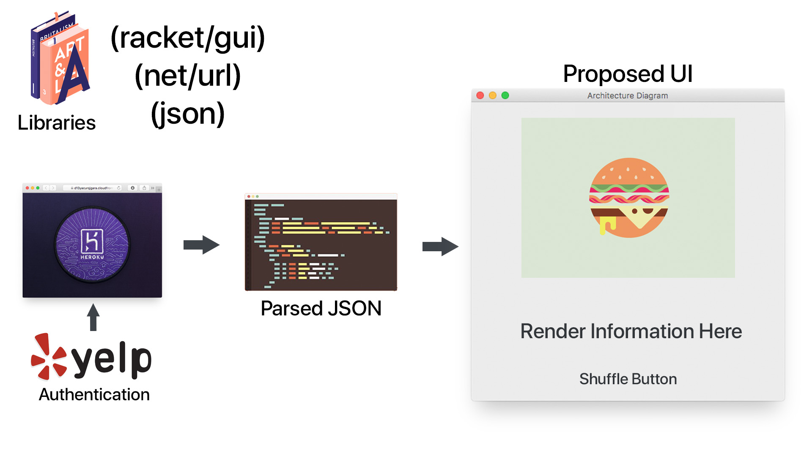

# Ballot

### Statement 

When deciding where we want to have lunch or dinner, we tend to be very indecisive. What if we had a handy program that will help you decide based on what kind of food you want at the time? 

## Analysis

Parsing JSON object responses today in popular languages such as `JavaScript`, `Swift`, `Ruby`, etc. typically involves mapping and filtering through dictionaries of information. Working through this project, required us to map and filter through a lot of objects in order to get the result that we want.

Because our interface required input from the user, we used state-modification. State-modification was used to change the default state of an object that has been binded to the global environment. We were forced to use `set!` to change the value of each object so it could be interpolated into the URL Request Strings to make the `GET` request.

## External Technologies and Data Sets

To retrieve data for rendering, we made `HTTP GET` requests to Yelp<a href="https://www.yelp.com/developers" target="_blank">Yelp</a>. Because it was rather cumbersome to make requests through OAuth (a standard for authenticating to a secure API, see https://oauth.net) to gain access to Yelp, we've deployed our own API on Heroku which completely disbands the whole process of authentication. 

In order to make this happen, we used the `net/url` library to make the GET request to the endpoint.

#### Parsing the JSON

To ease this process, we had to learn how <a href="https://docs.racket-lang.org/reference/dicts.html" target="_blank">dictionaries</a> function in Racket. (i.e. accessing an element given a key, retrieval, etc.) After obtaining a response from the API, we converted the pure port to a string, so we could convert it to a <a href="https://docs.racket-lang.org/json/" target="_blank">JSON</a> as well.

After obtaining the JSON and binding it to our environment, this is where the parsing really happened. Using accumulate, or <a href="https://docs.racket-lang.org/reference/pairs.html#%28def._%28%28lib._racket%2Fprivate%2Flist..rkt%29._foldr%29%29" target="_blank">foldr</a>, we created a list of businesses retrieved from the end point. Then, we used <a href="https://docs.racket-lang.org/reference/pairs.html#%28def._%28%28lib._racket%2Fprivate%2Fmap..rkt%29._map%29%29" target="_blank">map</a> to create our final list that will contain only the information that we will use to render in the application.
##### Keys to Map
<ul>
  <li>Name</li>
  <li>Location</li>
  <li>Open Status</li>
  <li>Rating</li>
  <li>Image URL for Rendering</li>
  <li>Possibly more..?</li>
</ul> 

##### Rendering the Information

To render the information, it required us to use the <a href="https://docs.racket-lang.org/draw/" target="_blank">`racket/draw`</a> library.
 

## Deliverable and Demonstration

The final product of this application is a program that will,
<ol>
  <li>Allow users to enter the type of `food` and the `location`</li>
  <li>Use the user's input to make a request to Yelp
  <li>Render a random point-of-interest related to the search term</li>
  <li>User will be able to "Shuffle" for another restaurant</li>
  <li>Error Handling: Render something if Yelp doesn't return any points-of-interest</li>
</ol>

As well as a working program, the information was rendered in a GUI frame.

##### Render Checklist
<ul>
  <li> Create a responsive frame </li>
  <li> Render response image for each businesses, with a size constraint </li>
  <li> Button Rendering for "shuffling" each businesses </li>
</ul>

##### Extra Features

<ul>
  <li> Avoided collisions when randomizing </li>
  <li> Rendered a UI that will be both responsive, and usable </li>
  <li> Made the front-end communicate with the back end to retrieve user inputs </li>
</ul>

#### Evaluation of Results

We were able to render such information in a working frame, so we know that we have successfully implemented the program.

## Architecture Diagram

Our architecture diagram consists of 3 parts, making a request from the Yelp API, parsing the JSON data from the request, and rendering the information in a GUI. In order to get the information from Yelp we first generated a link with the business information in JSON format. Using the net-url library, we took this information and converted it into usable information using the JSON library. This was done by first making and generating the link based on user input, retrieving the information from the url and saving into a variable. We used the JSON library functions to format the data into a JSON object which could be searched. Using the hash-ref function we entered which piece of information we would like to retrieve such as business names, locations and prices. We used accumulate to generate a list containing all the raw business information in JSON format and then mapped that list, creating a new list with just the information we want. Once we had all the information in an easy to manipluate format we made a simple GUI where information such as name, price and phone number can be shown to the user. We ded this by making a small frame and applied text to the frame with the information we wanted. Within this frame we added certain components like buttons and images. Since the Yelp API provides links to images of businesses, we once again used the net-url library to retrieve those images and displayed them in the GUI by adding an image section. Using a button had a function be called to change the information in each section of the GUI. We had the newly generated information come directly from the list we created using accumulate and map previously, meaning we did not need to do another API request. This allowed the user to click the button and generate a new result every time.

In all, the architecture of our project relied on a combination of 3 different libraries, net-url, json and gui. We were able to retrieve raw information from the web, parse it into a usable format and display it for any user so they could use it easily.

## Schedule

### First Milestone (Sun Apr 9)
By this time we were able to retrieve data from the Yelp API and generate JSON data that can actually be used. We had figured out how the net-url library retrieves data and how to reference the JSON result.

### Second Milestone (Sun Apr 16)
By this time we had full control over the JSON data retrieved form the Yelp API as well as developed the alogrithms necessary to convert the raw data into a readable format using accumulate and map. We also had a simple GUI set up so that we can begin to pass the JSON data to it and have it show on screen to the user.

## Public Presentation (Mon Apr 24, Wed Apr 26, or Fri Apr 28)
By this time we had a fully working GUI with all the JSON data available to be shown on screen. This included showing business names, prices, phone numbers and photos. We also added a feature where the user could randomly generate a business in their area and continue to generate them for as long as there is new data available, returning to the beginning after every business has been shown. We had this be done via keyboard input of location and a button that generates a random business.

## Group Responsibilities

### Brandon Karl @brandonkarl
For this project I was able to retriev the text data from the `(net-url)` request and create the JSON object. I was also able to implement the algorithms necessary to better organize the data into a useful way and have it be in a printable format, using accumulate and map. I was also able to help Serey with setting up the basic GUI for this information to be shown on screen. 

### Serey Morm @smorm

My portion of the work involved using the retrieved information and rendering it to the UI`(racket/gui)`. To render the images, I used the `(net/url)` library as well as making a responsive UI (scaling image size, buttons, text boxes, etc.). As well as setting up the interface, I also assisted Brandon with the HTTP get requests portion to obtain the JSON objects from our API.

